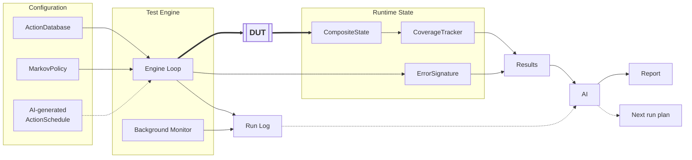

# Model-Based Testing, with AI assistance — Architecture Overview

High-level component relationship diagram (structural view: what talks to what).
For the runtime execution order, see `flow_chart.md`.
For field-level type definitions, see `data_structure.md`.

## Notes

- **Arrow convention differs from `data_structure.md` on purpose.** Arrows here
  describe data flow / production order — "what happens before what" — not
  structural ownership. Several entities appear in both slides with the arrow
  pointing the *opposite* way: e.g. this slide draws `LE --> TS` (log entries
  accumulate into a session over time), while `data_structure.md` draws
  `TestSession --> LogEntry` (UML composition: a session *owns* its log entries).
  Same pair, two different questions — flow order here, structural containment
  there — not a contradiction.
- `ActionDatabase` and `MarkovPolicy` are static configuration, loaded once per session.
- **Nothing in this diagram calls an LLM while the device is being driven.** There is no
  link from `AIB` into the Engine Loop at all: the LLM reads the run folder once the run
  has stopped, and what it writes goes to `Analysis/proposals/`. An earlier version had a
  thick `EL <=> AIB` pair — the `ai_explore` mode, one synchronous LLM call per step. It
  was dropped because choosing among the 28 actions the model already has is what dice do
  well and cheaply, while proposing the 29th is the thing only a reader of the logs can
  do.
- **The feedback loop is three loops, not one — and only one of them is about
  probability.** Everything the AI brain writes lands in `Analysis/proposals/`, and
  reaches **Configuration** only after a person accepts it. Which of the three it
  writes depends on what kind of finding came back:
  - **A specific bug** → `AIB --> SCH`. `ErrorSignature.reproductionSequence` is already
    an `ActionSchedule`; it goes into the next release as a `scripted` run. Raising a
    probability would only buy a *chance* of hitting that path again, while a scripted
    regression is a guarantee that costs no random budget at all. **Probability is for
    finding the unknown, not for re-testing the known** — a weight table used as a bug
    history slowly crowds out the paths nothing has explored yet.
  - **A coverage gap, or a region producing many *distinct* signatures** →
    `AIB --> MP`. This is the only proposal that touches
    weights. The distinction that decides between this and the first loop: the *same*
    bug recurring is a regression test's job; *different* bugs clustering in one
    neighbourhood means that neighbourhood is worth more dice.
  - **The model and the device disagreeing** → `AIB --> AD`. A run with
    An action-led probe produces exactly this evidence: actions the model calls illegal
    that the device accepts anyway (either the guard is too strict, or the device is
    missing a check — a bug), and actions the model calls legal that the device always
    refuses. Neither is fixable by any weight; the *model* is wrong, so the correction
    belongs in the Action Database. The same signal shows where the action set itself is
    too thin to express what the logs are showing.
- `ErrorSignature` now feeds back into `AI Brain` alongside `CoverageReport` — known bug
  clusters inform both what to avoid re-triggering by accident and what to deliberately
  replay for regression confidence.
- **`ErrorSignature` belongs with the runtime values, not with the analysis.** It is
  clustered the moment a failure happens and its `occurrenceCount` keeps rising for the
  rest of the run — the same shape as `CoverageTracker`, which is why they now sit
  together. What lands in `Analysis/` is the *file* each one writes out at the end.
- **This diagram is components, not files.** Every box is something a person could own
  or replace whole; which JSON lands where is `data_structure.md`. An earlier version drew
  the individual files here and it read as a file listing with arrows — two levels of
  detail in one picture, and the second one already had a home.
- **The labels live in the caption, not on the arrows.** Every transition label rendered as a
  small box on the line, so a diagram of eight components read as twelve. What each link
  means — actions out and observed state back, dashed for read-only or infrequent — is
  said once in prose instead.
- **The device is one box on purpose.** What sits behind it — the Pod's own API, a smart
  PDU, a controllable AP, a phone on ADB — is reached entirely through a single
  `Driver` interface. At this level that is one boundary, and the
  only place anything touches hardware.

- Grouping matches *when* each item is produced, not just what it is for:
  `ResourceSnapshot` sits in **Recording** (a live periodic record, same as `LogEntry`),
  while `CoverageTracker` and `ErrorSignature` sit in **Runtime State** — both are
  continuously updated working values, read and written on every step.
- Two arrow directions were backwards in the previous version and are now fixed:
  `CoverageTracker` is updated straight from `CompositeState` on every step
  (`CS --> CT`), not from the finished `TestSession`; and `ErrorSignature` is produced
  live by the `Engine Loop` at the moment of failure (`EL --> ES`), not by the
  `TestSession` after it's saved — `TestSession` only ends up *referencing* it via
  `errorSignatureId`.
- `CoverageTracker` performs exact set arithmetic in Python — no AI involvement in the
  counting itself — in every mode. It also separates *issued* from *accepted*: an action
  the device refused every time lands in `CoverageReport.refusedActions`, not in the
  covered count. The AI reads the
  resulting `CoverageReport`; it never produces the number.
- `OracleCheck` (see `flow_chart.md`) is not its own box here — it's logic inside
  `Engine Loop`, run right after a `CompositeState` update, reading
  `ActionDefinition.postcondition` from Config. Like `ErrorSignature` before this
  revision, it's a step this diagram doesn't yet surface as a distinct component.
- **Fault scheduling isn't a second architecture, it's a differently-paced worker.** A
  worker with a schedule and no chain runs on its own wall-clock timer instead of waiting
  for its last action to resolve — which is the only way `inject_dhcp_timeout` can fire
  while `api_connect_wifi` is still in progress on another worker. Every worker, whatever
  its kind, reads the same `ActionDatabase`.

- **Concurrent instances mostly don't contend, because `ActionDefinition.executor`
  splits them onto different physical interfaces.** The obvious worry is that two
  `EngineLoop` instances driving the device at once need a thread-safe Driver. In the
  configuration this design actually uses, they aren't driving the same thing: a
  worker scoped `executorFilter: ["equipment"]` talks to a smart plug, a controllable
  AP, a DHCP server, an RF attenuator — none of which is the Pod's API — while the
  `["dut"]` workers only ever talk to the Pod. Shared *state* (`CompositeState`,
  `CoverageTracker`) still needs a lock; the Driver-contention problem that looked
  like the price of concurrency largely dissolves once `executor` is explicit.
- **`EL[Engine Loop]` is drawn as one box, but it's a class that can be instantiated
  more than once per session.** How many, what each instance is scoped to
  (`componentFilter` — which component; `executorFilter` — the Pod's own API or the
  test equipment around it), and how each one paces itself (`avgIntervalMs`) are all configuration
  choices (`WorkerConfig`, see `data_structure.md`) — not fixed at one, not fixed
  at "one per component," and not fixed at "one is a fault scheduler." The default is
  a single `sync_scheduler` instance covering the whole `ActionDatabase` (today's
  behavior, unchanged); a user can just as easily configure three positive-action
  instances (one per component) plus a fourth `async_scheduler` instance for
  fault injection — four boxes worth of behavior from one class, parameterized four
  different ways.
