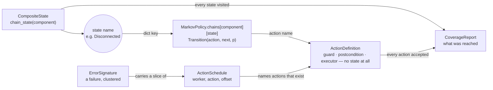
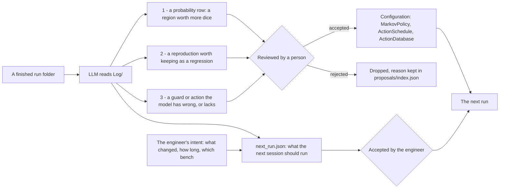

# Model-Based Testing, with AI assistance — Data Structure

The full reference behind Slide 03 of `pod_mbt_blueprint.html`: every enum value,
the complete 32-row Action Database, and the complete 24-transition chain table.
The Blueprint keeps only the four things a reader decides from (the action
taxonomy, how `MarkovPolicy` and `proposals/` fit together, what the AI is and
is not allowed to do, and the run-folder shape) and points here for the rest.

Six shapes carry this design. Everything else in <code>pod_mbt/</code> is plumbing around them — and the one thing worth noticing first is that the state a worker is in never lives on the action. It lives in <code>CompositeState</code>, gets read off as a state name, and that name is looked up as a key into <code>MarkovPolicy</code> — which is what lets the same action behave differently depending on where it is called from.

*<b>Fig. 2</b> — the state lives in <code>MarkovPolicy</code>, not in <code>ActionDefinition</code>. <code>CompositeState.chain_state(component)</code> names where a worker is; <code>MarkovPolicy</code> looks that name up as a dict key and returns the transitions available from it. <code>ActionDefinition</code> never sees a state at all — it only carries what a call needs to be judged (<code>guard</code>, <code>postcondition</code>, <code>executor</code>), which is exactly what lets the same action appear under many different states in the chain, behaving differently each time it does. <code>ActionSchedule</code> is the other shape worth knowing: a test case, a saved reproduction, and an AI-written plan are all the same three fields.*

<table class="ref-table">
        <thead><tr><th>Enum</th><th>Values</th><th>Notes</th></tr></thead>
        <tbody>
          <tr><td>PowerState</td><td><code>Active</code>, <code>Power_Off</code></td><td></td></tr>
          <tr><td>WifiState</td><td><code>Disconnected</code>, <code>Scanning</code>, <code>Connecting</code>, <code>Connected</code>, <code>Streaming</code></td><td></td></tr>
          <tr><td>WifiConnectingSubState</td><td><code>Associating</code>, <code>AwaitingDhcp</code>, <code>VerifyingConnectivity</code></td><td>Only while <code>wifi = Connecting</code></td></tr>
          <tr><td>BtLinkState</td><td><code>Idle</code>, <code>Advertising</code>, <code>Pairing</code>, <code>Connected</code></td><td></td></tr>
          <tr><td>BtAudioRole</td><td><code>None</code>, <code>Streaming</code></td><td></td></tr>
          <tr><td>MatterState</td><td><code>Uncommissioned</code>, <code>Commissioning</code>, <code>Operational</code>, <code>Fabric_Removing</code></td><td></td></tr>
          <tr><td>NetworkUplink</td><td><code>Healthy</code>, <code>Degraded</code>, <code>Down</code></td><td>Environment var — not a <code>CompositeState</code> field</td></tr>
          <tr><td>StressLevel</td><td><code>Normal</code>, <code>Elevated</code>, <code>Critical</code></td><td>Two variables (<code>cpuLoad</code>, <code>memPressure</code>), same treatment as <code>NetworkUplink</code></td></tr>
          <tr><td>ActionCategory</td><td><code>api</code>, <code>fault_injection</code></td><td><em>What</em> the action does — normal use vs. deliberately breaking something</td></tr>
          <tr><td>—</td><td>guard modes are gone</td><td>The chain says what can be issued; the guard says what should succeed. It never gates, so there is nothing to configure</td></tr>
          <tr><td>ExecutorType</td><td><code>dut</code>, <code>equipment</code></td><td><em>Who</em> performs it — the Pod's own API vs. test equipment outside it (Fig. 4)</td></tr>
          <tr><td>EventType</td><td><code>action_trigger</code>, <code>state_change</code>, <code>oracle_result</code>, <code>sys_panic</code>, <code>resource_snapshot</code>, <code>async_fault_fired</code>, <code>async_fault_missed</code></td><td></td></tr>
          <tr><td>WorkerKind</td><td><code>walk</code>, <code>probe</code>, <code>sweep</code>, <code>schedule</code></td><td>Not a mode a session picks: which block of the plan a worker came from</td></tr>
          <tr><td>FireStatus</td><td><code>pending</code>, <code>fired</code>, <code>missed</code></td><td><code>ScheduledAction</code> only</td></tr>
        </tbody>
      </table>

## What one run writes — the run folder

A session is not a file, it is a folder, named for when it started and what it ran. <code>Log/</code> is what the run produced while it was happening; <code>Analysis/</code> is everything derived after it stopped. Nothing crosses that line in the wrong direction, which is what makes the folder safe to hand to an LLM: it can read all of <code>Log/</code> and write only into <code>Analysis/</code>.

<pre class="code-json">20260915-163829_NIGHTLY-014/
├─ session.json                  config, seed, modelVersion, delta-T, result summary
├─ Log/
│  ├─ ActionSchedule.json        every action issued: workerId, actionName, offset
│  ├─ EngineEvents.jsonl         action_trigger, state_change, oracle_result, async_fault_*
│  ├─ DeviceLog/dut.log          the device's own output, read off UART
│  └─ ResourceSnapshot.json      CPU / memory / uplink, sampled every 30s
└─ Analysis/
   ├─ CoverageReport.json        computed in Python — states, actions, refused_actions
   ├─ ErrorSignature.json        clustered failures, each with its reproduction
   ├─ report.md                  written by the LLM, from Log/
   └─ proposals/                 what to change before the next run — reviewed, then applied</pre>

- <b><code>session.json</code> is what makes the rest replayable.</b> The seed, the worker configs, and <code>modelVersion</code> — a hash of the Action Database and the policy rows. A reproduction replayed against a different model is not the same test, so Replay prints the mismatch rather than pretending. On a bench it also carries <code>hostToDeviceClockOffsetMs</code>, the delta-T from Fig. 3's handshake: without it, <code>DeviceLog</code> timestamps cannot be lined up against anything else in the folder.
- <b>Three producers, kept apart on purpose.</b> <code>EngineEvents</code> is what the framework believed, <code>DeviceLog</code> is what the device said, and <code>ResourceSnapshot</code> is what the device was carrying at the time. Most of what a person does with a failure is compare the first two; most of what finds a leak is the slope of the third.
- <b><code>ActionSchedule.json</code> is the whole run, not a summary of it.</b> An <code>ErrorSignature</code>'s reproduction is a slice of this file, in the same format — which is why a found bug becomes a regression by selecting lines rather than by generating anything.
- <b>The numbers in <code>CoverageReport</code> are computed in Python, not written by the LLM.</b> Set arithmetic is exact and reproducible; a model asked for the same count twice is neither. The LLM reads the report — it never produces the number.

## What goes into `proposals/`

The one folder in a run that is an <em>input</em> to the next run rather than a record of this one. Each proposal names what to change, in which file, and the evidence from this run that argues for it — and carries a status, because nothing in here is applied until a person accepts it.

*<b>Fig. 2b</b> — what the AI writes between runs, and the two gates it passes through. A <b>proposal</b> changes the model and waits for review; a <b>plan</b> changes only what the next session exercises, and the engineer still accepts it before it runs. Three kinds of finding, three different files, one review gate: nothing an LLM proposes reaches <code>Configuration</code> without a person accepting it.*

- <b>Every proposal carries the same envelope:</b> <code>id</code> and <code>type</code>; <code>baseVersion</code>, the <code>modelVersion</code> it was written against, so a proposal cannot be applied to a model that has moved on; <code>target</code>, the file and key it would change; <code>current</code> → <code>proposed</code>; <code>evidence</code>, pointing into this run's <code>Log/</code> by offset or by <code>signatureHash</code>; a one-line <code>rationale</code>; and <code>status</code> — <code>pending</code>, <code>accepted</code> or <code>rejected</code>.
- <b>A regression proposal is a slice, not a new file.</b> It names a span of <code>Log/ActionSchedule.json</code> plus the state that span started from — the same shape Replay already consumes, which is why accepting one costs nothing but review.
- <b>A probability proposal must show the whole row.</b> Rows sum to 1, so raising one entry lowers the others; the proposal renders the row after renormalization, because the entries it quietly lowers are the part worth arguing about.
- <b>A model correction is the one a person must judge, not merely approve.</b> "The device accepted a call the model calls illegal" has two readings — the guard is too strict, or the device is missing a check. The first is a documentation fix; the second is a bug in the product. The LLM can put both on the table; only a person decides which one it is.
- <b>Rejected proposals keep their reason.</b> <code>index.json</code> holds the whole list with its verdicts, so the same suggestion arriving three releases running reads as a pattern rather than as a new idea.

## Action taxonomy — `category` × `executor` × `component`

Three orthogonal labels on <code>ActionDefinition</code>, and keeping them orthogonal is what lets one flat Action Database serve every worker configuration without a second list anywhere. <code>component</code> says which part of the device the action concerns — <code>wifi</code>, <code>bt</code> and <code>matter</code> map onto <code>CompositeState</code>'s protocol regions, and <code>system</code> covers what affects the whole device rather than one stack (power, CPU, memory). <code>category</code> says whether it's normal use or deliberate breakage. <code>executor</code> says who physically performs it. <b>The common mistake is assuming <code>fault_injection</code> means "environmental" — it doesn't:</b> a fault can be something the Pod is perfectly capable of doing to itself, like being handed a wrong password.

<table class="ref-table">
        <thead><tr><th>component</th><th><code>executor = dut</code></th><th><code>executor = equipment</code></th></tr></thead>
        <tbody>
          <tr><td>wifi</td><td><code>api_connect_wifi</code>, <code>api_disconnect_wifi</code>, <code>api_get_dhcp</code>, <code>api_get_ipadd</code>, <code>api_streaming_uplink</code>, <code>api_streaming_downlink</code>, <b><code>api_inject_wrong_psk</code></b>, <b><code>api_inject_wrong_ipaddr</code></b></td><td><code>inject_wifi_drop</code>, <code>inject_router_reboot</code>, <code>inject_internet_down</code>, <code>inject_dhcp_timeout</code>, <code>inject_ap_psk_changed</code>, <code>inject_ap_ssid_changed</code></td></tr>
          <tr><td>bt</td><td><code>api_bt_pairing</code>, <code>api_bt_connect</code>, <code>api_bt_disconnect</code>, <code>api_bt_audio_streaming</code>, <b><code>api_inject_wrong_devicename</code></b>, <b><code>api_inject_no_peer</code></b></td><td><code>inject_phone_disconnect</code>, <code>inject_phone_out_of_range</code>, <code>inject_phone_reboot</code></td></tr>
          <tr><td>matter</td><td><code>api_start_matter</code>, <code>api_complete_matter_commissioning</code>, <code>api_remove_matter_fabric</code>, <b><code>inject_wrong_setup_code</code></b></td><td><code>inject_matter_controller_reject</code></td></tr>
          <tr><td>system</td><td><b><code>inject_cpu_stress</code></b>, <b><code>inject_memory_stress</code></b>, <b><code>clear_system_stress</code></b></td><td><code>inject_power_reboot</code></td></tr>
        </tbody>
      </table>

- <b>Bold cells are <code>fault_injection</code> actions with <code>executor = dut</code>.</b> They belong to that component's own worker, not to a fault worker — a real user does sometimes type the wrong Wi-Fi password or scan a stale Matter setup code, and how often that happens is a <code>MarkovPolicy.baseRows</code> decision, not a reason to quarantine the action in a separate worker.
- <b>Not every fault moves a state — some only change the conditions other transitions run under.</b> <code>inject_cpu_stress</code> and <code>inject_memory_stress</code> leave Wi-Fi <code>Connected</code>, BT <code>Paired</code> and Matter <code>Operational</code> exactly where they were; what they change is how long the <em>next</em> transition takes and how likely it is to fail. They follow the <code>NetworkUplink</code> precedent exactly — flat variables (<code>cpuLoad</code>, <code>memPressure</code>) read by <code>guard</code>/<code>postcondition</code>, deliberately <b>not</b> new <code>CompositeState</code> regions, since adding regions multiplies the coverage state space for no diagnostic gain. Their payoff is already wired up: <code>details.elapsedMs</code> is recorded on every <code>OracleCheck</code> and a rising trend there is a leading indicator of failure — these two actions are how you <em>deliberately</em> produce that trend instead of waiting for it. Both are <code>executor = dut</code>, so they need no bench hardware, and both name <code>clear_system_stress</code> as their <code>cleanupAction</code>.
- <b>This is also the slide that tells you what hardware to buy.</b> The right-hand column <em>is</em> Fig. 4's Lab Bench — every box on that slide exists because some action in this column cannot be performed by the Pod itself. Nothing in the left-hand column needs any of it.
- <b>Two actions were split in two, for the same reason each time: one name was hiding two root causes, so a failure report could not say which one happened.</b> <code>api_inject_wrong_psk</code> now covers only the Pod being handed a bad credential over its own API (<code>executor = dut</code>); the case where the <em>access point</em> changes its PSK and the Pod's stored credential goes stale is <code>inject_ap_psk_changed</code> (<code>executor = equipment</code> — it needs a scriptable AP). The Pod's correct behaviour differs between them: one is "reject bad input," the other is "detect that a previously-good credential stopped working." <code>inject_matter_commissioning_failure</code> was split the same way, into <code>inject_wrong_setup_code</code> (the Pod rejecting a bad setup code) and <code>inject_matter_controller_reject</code> (an external controller refusing or timing out). <code>inject_ap_ssid_changed</code> sits beside <code>inject_ap_psk_changed</code> rather than replacing it, for the same reason: the AP renaming itself and the AP's password changing are two different real faults, and collapsing them back into one name would lose exactly the distinction the split was for.
- <b>Every relationship is a plain arrow on purpose.</b> Mermaid's formal UML composition/dependency glyphs (filled diamonds, dashed lines) exist, but at this diagram's density they render too small to actually tell apart. The label carries the meaning instead: <code>owns, deleted together</code> marks the two true composition relationships (a <code>LogEntry</code> or <code>ActionSequence</code> means nothing outside its parent); <code>produces</code>/<code>consumes</code> mark a transient create-or-read; everything else is an ongoing reference with no ownership claim either way.
- <code>EngineLoop</code> is deliberately a stub here — one <code>run()</code> method. Its real behavior is all of Fig. 3, not a handful of fields; it's included at all so <code>TestRecorder</code> and <code>ReplayEngine</code> don't read as the only things doing work — everything they do happens on its behalf.
- <b><code>ErrorSignature.reproductionSequence</code> is an <code>ActionSchedule</code>, not a flat list of action names — because a concurrency bug's reproduction is itself concurrent.</b> It used to be <code>list&lt;string&gt;</code>, which works for a single-worker failure but silently loses what caused a concurrent one: <em>who</em> acted and <em>when</em>. A fault that landed while Matter was mid-<code>commission</code> reproduces as an ordinary post-commission fault once the timing is thrown away, and the bug doesn't reappear. Reusing <code>ActionSchedule</code> means a distilled reproduction and a hand-authored fault plan are the same type, so a regression run executes them identically — which is what lets a bug found by a random concurrent run become a permanent regression test. <code>ScheduledAction.workerId</code> exists for exactly this: a hand-authored schedule belongs to one worker and can leave it unset; a reproduction spanning four workers cannot. It still does double duty as the dedup key for a crash cluster, and <code>triggerType</code> still tells a hard crash apart from a silent postcondition failure.
- <b><code>ReplayEngine.replay()</code> takes an <code>ActionSchedule</code>, not a <code>TestSession</code>.</b> An earlier draft had the signature say <code>replay(session)</code> while the note above said it replays <code>reproductionSequence</code> — two different inputs for one method. The schedule is correct: most of a session's log isn't executable at all (<code>state_change</code>, <code>oracle_result</code>, <code>resource_snapshot</code> and <code>guard_blocked</code> are observations, not actions), so <code>loadSession</code> is how you <em>reach</em> an <code>ErrorSignature</code>, and the schedule it carries is what actually runs.
- <b>There is one list format, not two.</b> An earlier draft had <code>ActionSequence</code> (ordered, for a stepwise worker) beside <code>ActionSchedule</code> (timestamped, for a wall-clock one). They collapsed into <code>ActionSchedule</code>: every action a run issues is recorded with its worker and its offset either way, so a slice of a finished run is already a runnable list. A sync worker replays it in order and an async worker on its offsets — which the worker’s own config decides, not the file. Names are still validated against <code>ActionDefinition</code> at load time, so a proposed regression naming an action that no longer exists fails loudly rather than silently skipping a step.
- <code>NetworkUplink</code> models the home router / internet condition, but stays off <code>CompositeState</code> on purpose — folding an external dependency into the coverage tuple is how state explosion comes back. Router and phone conditions live in the Action Database instead, as <code>fault_injection</code> actions — note they carry <code>component: wifi</code> and <code>component: bt</code>, <b>not</b> a component of their own. An earlier draft gave them <code>network_infra</code> / <code>bt_peer</code>, which was a mistake: <code>component</code> answers "which <code>CompositeState</code> region does this move," and a router reboot moves the <em>Wi-Fi</em> region. What made router and phone feel like separate components was really <em>who performs the action</em> — now <code>executor = equipment</code>, on its own axis.
- <code>guard</code> is a precondition — it blocks an illegal call before it runs. The new <code>postcondition</code> field is checked after: a call can pass its guard, run cleanly, and still land the Pod in a state that's wrong (<code>Connected</code> with no valid IP). That's what <code>oracle_result</code> catches.
- <code>postconditionTimeoutMs</code> exists because real hardware effects aren't instantaneous — checking the instant a call returns produces false failures on timing alone, not on a real bug. The check polls on the Host clock until it resolves or this budget runs out, and logs how long it actually took as <code>details.elapsedMs</code> — a rising trend there is often a leading indicator of a failure that hasn't happened yet.
- <b>No mode has <code>ai_</code> in its name, and that is the design decision.</b> An earlier draft had <code>ai_explore</code> (an LLM call inside the loop, on every step) and <code>ai_pregenerated</code> (a list an AI wrote offline). The second was removed first: it named the author of a file rather than any behaviour of the loop, so a worker reading it is simply <code>scripted</code>. The first went the same way for a stronger reason — an LLM choosing the next action still only ever picks from the 28 actions the model already has, while the same LLM reading a finished run can propose the actions the model is <em>missing</em>. Slide 07 carries the argument in full.
- <b><code>api_connect_wifi</code> stays one action, and the states inside it carry no row.</b> <code>Connecting</code> is a window the Driver observes while that call is in flight, not a place a stepwise worker gets a turn — which is why a fault that needs that window has to be scheduled rather than rolled.
- <b>What a worker needs is small.</b> An id, a kind, the component it is scoped to, and a pace. A probe adds its pool; a schedule adds its list of times. There is no mode field, because the block of the plan a worker came from already says what it is.
- <code>ScheduledAction.scheduledOffsetMs</code> is a wall-clock offset from session start, deliberately not tied to any other worker's step count — the whole point is to be indifferent to which step those workers happen to be on. The <code>async_scheduler</code> worker checks the trigger's Guard at fire time; if it's not satisfied (reality drifted further from the offline estimate than expected, e.g. slower DHCP than assumed), the trigger is logged <code>missed</code> and the worker moves on rather than retrying or blocking. A <code>missed</code> trigger is itself a signal, not just a wasted slot — it means the real device's timing profile diverged from what the schedule assumed.
- <b>Authoring guideline, not a schema requirement:</b> pick <code>scheduledOffsetMs</code> values as consistent multiples of one interval size, chosen for the test's intent — a real state transition, a fault's effect, and its cleanup all take non-trivial time, so an interval too short just produces more <code>missed</code> triggers. Roughly a 1-minute interval is plenty for a functional/non-stress run; a stress or reliability run can tighten that to 1-2 minutes to add pressure. This is deliberately left as a convention for whoever authors a schedule (human or AI) rather than a field on <code>ActionSchedule</code> — the class only needs to hold whatever offsets it's given, and one more field nobody's logic actually reads is complexity this design doesn't need.
- The schedule's contents (how many triggers, roughly when) can be estimated offline via simulation, cheaply, before ever touching real hardware — but whether a given trigger actually fires is always decided live, against the real <code>CompositeState</code> at that instant. Precomputing the full outcome in advance and blindly replaying it against real hardware would defeat the purpose: real hardware is tested precisely because its timing can't be fully predicted ahead of time.
- <code>ActionCategory</code> finally has consumers: <code>PendingCleanup</code> is what a <code>fault_injection</code> action with a <code>cleanupAction</code> schedules right after it runs — see Fig. 3 for the branch that guarantees it fires within a bounded number of steps. <code>CoverageReport.faultInjectionCoverage</code> is a derived read of <code>CoverageTracker.visitedTransitions</code> filtered by category — no new tracking needed.
- <b><code>MarkovPolicy.baseRows</code> is a real transition matrix, not a list of global weights — and that difference is why the class was reshaped.</b> It is <code>dict[sourceState, dict[actionName, float]]</code>: one row per state the model can be in, and <b>each row sums to 1</b>. An earlier draft carried a single weight per action, applied everywhere that action was legal. That induced a Markov process — the next step depended only on the current state — but it was never a transition matrix, and it could not express the thing per-state probability exists for: <b>the same action being more or less likely depending on where you are</b>. The worked case is <code>api_bt_disconnect</code>: 0.10 from <code>Idle</code> (issuable, expected refused — nobody hangs up a call that was never placed), 0.35 from <code>Connected · None</code>, 0.70 from <code>Connected · Streaming</code> — a person is far more likely to hit disconnect once something is already going wrong mid-stream than moments after just connecting. One global weight holds one of those numbers, never all three.
- <b>Rows are keyed on a single region's state, which is why this does not explode.</b> The composite state is a tuple of six regions, so a matrix over composite states would run to thousands of rows. <code>sourceState</code> names one region, and a worker is scoped to one component anyway — the entire Wi-Fi policy is 3 rows and 9 numbers. The guard already encodes which actions are available where; the row only says how to choose among them.
- <b>A worker sees its row exactly as printed.</b> <code>next_transition()</code> takes the row for the current state and rolls it — no filtering by executor, no renormalization, no guard in the way. The number in Slide 03 is the number the dice use, which is the only way the stationary distribution means anything.
- <b>A weighting change is a proposal, never a write.</b> Nothing in <code>pod_mbt/</code> lets an analyst multiply a row at runtime; what it can do is write a proposal naming the row and the evidence, which a person accepts before it reaches <code>policy.py</code>. Renormalization is what makes that proposal honest: because a row must sum to 1, <b>raising one entry necessarily lowers the others</b>. A free-floating weight list could inflate forever; a probability row forces the proposal to say what it is giving up.
- <b>Fault injection is an instance of the same class, not a second architecture.</b> A worker with a schedule and no chain is the fault clock; a worker with a chain is a walker. The difference is what it reads, not what it is.
- <b>This is why <code>TestSession.mode</code> got removed.</b> A single session-level <code>TestMode</code> stopped making sense once different concurrent workers can each run a different mode — <code>EngineLoopConfig.mode</code> now carries that per-worker.
- <b>Cross-component <code>guard</code> conditions are the user's choice to keep or drop for this architecture</b>, not something the framework forces either way. Scoping a worker to one component doesn't by itself strip a <code>guard</code> that references a <em>different</em> component's state (e.g. <code>api_start_matter</code>'s guard on <code>wifi = Connected</code>) — if that cross-reference stays active, a Matter-only worker can stall waiting on a condition it has no way to influence. Turning it off and letting the real device be the sole arbiter of legality is a legitimate, deliberate choice — it tests the device's own robustness against out-of-order calls instead of the framework politely avoiding them — but it's a choice, not a silent default.
- <b>Recording needed no changes for this.</b> Concurrent workers' <code>LogEntry</code>s interleave into the same <code>TestSession.log</code> naturally, since they were always ordered by <code>hostEpochNs</code>, not by which loop produced them.
- <code>CompositeState</code> and <code>CoverageTracker</code> do need an implementation guarantee this design didn't previously require: thread safety. Each worker only writes its own field, which limits the blast radius, but <code>as_tuple()</code> reading every field at once and <code>CoverageTracker.visitedStates.add(...)</code> both need a lock (or equivalent) to avoid reading a half-updated tuple once more than one worker is running.

## The Action Database — the contract, not the graph

Thirty-two calls. Each one says when it is legal (<code>guard</code>), what must be true once it has been accepted (<code>postcondition</code>), how long that may take, and what undoes it. It says nothing about where it starts or where it lands: the same call is issuable from many states and behaves differently in each, so the transition belongs to the chain.

That split is what lets one database serve both kinds of run. A state-led walk reads the chain to choose and the guard to judge; an action-led probe ignores the chain entirely and still gets judged by the same guard. <b>Chance may choose the call; only the model says whether it should have worked.</b>

<table class="ref-table">
        <thead><tr><th>action</th><th>component</th><th>executor</th><th>guard</th><th>postcondition</th><th>budget</th><th>cleanupAction</th></tr></thead>
        <tbody>
          <tr><td><code>api_bt_audio_streaming</code></td><td>bt</td><td>dut</td><td>bt_link = Connected ∧ bt_audio = None</td><td>bt_audio = Streaming ∧ stream active within 5s</td><td>5s</td><td>—</td></tr>
          <tr><td><code>api_bt_connect</code></td><td>bt</td><td>dut</td><td>bt_link = Idle</td><td>bt_link = Connected ∧ bt_audio = None within 5s — already bonded, no pairing handshake</td><td>5s</td><td>—</td></tr>
          <tr><td><code>api_bt_disconnect</code></td><td>bt</td><td>dut</td><td>bt_link = Connected</td><td>bt_link = Idle ∧ bt_audio = None</td><td>10s</td><td>—</td></tr>
          <tr><td><code>api_bt_pairing</code></td><td>bt</td><td>dut</td><td>bt_link = Idle</td><td>bt_link = Connected ∧ bt_audio = None within 10s</td><td>10s</td><td>—</td></tr>
          <tr><td><code>api_inject_no_peer</code></td><td>bt</td><td>dut</td><td>bt_link = Idle</td><td>bt_link = Idle ∧ error = no_peer_found</td><td>5s</td><td>—</td></tr>
          <tr><td><code>api_inject_wrong_devicename</code></td><td>bt</td><td>dut</td><td>bt_link = Idle</td><td>bt_link = Idle ∧ error = wrong_device_name</td><td>5s</td><td>—</td></tr>
          <tr><td><code>inject_phone_disconnect</code></td><td>bt</td><td>equipment</td><td>bt_link = Connected</td><td>bt_link = Idle within 5s</td><td>5s</td><td><code>api_bt_connect</code></td></tr>
          <tr><td><code>inject_phone_out_of_range</code></td><td>bt</td><td>equipment</td><td>bt_link = Connected</td><td>bt_link = Idle within 15s</td><td>15s</td><td><code>api_bt_connect</code></td></tr>
          <tr><td><code>inject_phone_reboot</code></td><td>bt</td><td>equipment</td><td>bt_link = Connected</td><td>bt_link = Idle within 15s</td><td>15s</td><td><code>api_bt_connect</code></td></tr>
          <tr><td><code>api_complete_matter_commissioning</code></td><td>matter</td><td>dut</td><td>matter = Commissioning</td><td>matter = Operational within 75s</td><td>75s</td><td>—</td></tr>
          <tr><td><code>api_remove_matter_fabric</code></td><td>matter</td><td>dut</td><td>matter = Operational</td><td>matter = Uncommissioned within 20s</td><td>20s</td><td>—</td></tr>
          <tr><td><code>api_start_matter</code></td><td>matter</td><td>dut</td><td>matter = Uncommissioned ∧ wifi = Connected</td><td>matter = Commissioning within 5s</td><td>5s</td><td>—</td></tr>
          <tr><td><code>inject_matter_controller_reject</code></td><td>matter</td><td>equipment</td><td>matter = Commissioning</td><td>matter = Uncommissioned within 30s ∧ error = controller_refused</td><td>30s</td><td>—</td></tr>
          <tr><td><code>inject_wrong_setup_code</code></td><td>matter</td><td>dut</td><td>matter = Commissioning</td><td>matter = Uncommissioned ∧ error = invalid_setup_code</td><td>10s</td><td>—</td></tr>
          <tr><td><code>clear_system_stress</code></td><td>system</td><td>dut</td><td>cpuLoad ≠ Normal ∨ memPressure ≠ Normal</td><td>cpuLoad = Normal ∧ memPressure = Normal within 10s</td><td>10s</td><td>—</td></tr>
          <tr><td><code>inject_cpu_stress</code></td><td>system</td><td>dut</td><td>power = Active ∧ cpuLoad = Normal</td><td>cpuLoad = Critical within 10s</td><td>10s</td><td><code>clear_system_stress</code></td></tr>
          <tr><td><code>inject_memory_stress</code></td><td>system</td><td>dut</td><td>power = Active ∧ memPressure = Normal</td><td>memPressure = Critical within 10s</td><td>10s</td><td><code>clear_system_stress</code></td></tr>
          <tr><td><code>inject_power_reboot</code></td><td>system</td><td>equipment</td><td>power = Active</td><td>power = Active ∧ wifi = Disconnected ∧ bt_link = Idle ∧ matter = Uncommissioned within 50s</td><td>50s</td><td>—</td></tr>
          <tr><td><code>api_connect_wifi</code></td><td>wifi</td><td>dut</td><td>wifi = Disconnected</td><td>wifi = Connected within 30s</td><td>30s</td><td>—</td></tr>
          <tr><td><code>api_disconnect_wifi</code></td><td>wifi</td><td>dut</td><td>wifi ∈ {Connected, Streaming}</td><td>wifi = Disconnected within 5s</td><td>5s</td><td>—</td></tr>
          <tr><td><code>api_get_dhcp</code></td><td>wifi</td><td>dut</td><td>wifi ∈ {Connected, Streaming}</td><td>lease renewed ∧ wifi unchanged within 10s</td><td>10s</td><td>—</td></tr>
          <tr><td><code>api_get_ipadd</code></td><td>wifi</td><td>dut</td><td>wifi ∈ {Connected, Streaming}</td><td>address read back ∧ wifi unchanged within 3s</td><td>3s</td><td>—</td></tr>
          <tr><td><code>api_inject_wrong_ipaddr</code></td><td>wifi</td><td>dut</td><td>wifi = Disconnected</td><td>wifi = Disconnected ∧ lastError = invalid_ip_config</td><td>10s</td><td>—</td></tr>
          <tr><td><code>api_inject_wrong_psk</code></td><td>wifi</td><td>dut</td><td>wifi = Disconnected</td><td>wifi = Disconnected ∧ lastError = auth_failure</td><td>10s</td><td>—</td></tr>
          <tr><td><code>api_streaming_downlink</code></td><td>wifi</td><td>dut</td><td>wifi = Streaming</td><td>wifi = Streaming within 5s</td><td>5s</td><td>—</td></tr>
          <tr><td><code>api_streaming_uplink</code></td><td>wifi</td><td>dut</td><td>wifi = Connected</td><td>wifi = Streaming within 5s</td><td>5s</td><td>—</td></tr>
          <tr><td><code>inject_ap_psk_changed</code></td><td>wifi</td><td>equipment</td><td>wifi ∈ {Connected, Streaming}</td><td>wifi = Disconnected within 10s</td><td>10s</td><td><code>api_connect_wifi</code></td></tr>
          <tr><td><code>inject_ap_ssid_changed</code></td><td>wifi</td><td>equipment</td><td>wifi ∈ {Connected, Streaming}</td><td>wifi = Disconnected within 10s</td><td>10s</td><td><code>api_connect_wifi</code></td></tr>
          <tr><td><code>inject_dhcp_timeout</code></td><td>wifi</td><td>equipment</td><td>wifi ∈ {Connected, Streaming}</td><td>wifi leaves Connected within 30s</td><td>30s</td><td><code>api_connect_wifi</code></td></tr>
          <tr><td><code>inject_internet_down</code></td><td>wifi</td><td>equipment</td><td>NetworkUplink = Healthy</td><td>NetworkUplink = Down ∧ wifi stays Connected</td><td>10s</td><td>—</td></tr>
          <tr><td><code>inject_router_reboot</code></td><td>wifi</td><td>equipment</td><td>power = Active</td><td>NetworkUplink returns to Healthy within 90s</td><td>90s</td><td>—</td></tr>
          <tr><td><code>inject_wifi_drop</code></td><td>wifi</td><td>equipment</td><td>wifi ∈ {Connected, Streaming}</td><td>wifi = Disconnected within 5s</td><td>5s</td><td><code>api_connect_wifi</code></td></tr>
        </tbody>
      </table>

- <b>The guard shrank when the transitions moved out.</b> It no longer restates what the chain already says — "from <code>Connected</code> you may disconnect" is the graph's job. What is left is the cross-component and environmental preconditions a per-component chain cannot express: <code>api_start_matter</code> needs <code>wifi = Connected</code>, <code>api_connect_wifi</code> needs credentials stored.
- <b>The postcondition <em>is</em> the destination, written as an assertion.</b> "<code>wifi = Connected within 30s</code>" says where the call lands and what else must hold — so a separate <code>destState</code> field would be the same fact written twice, and two copies drift.
- <b><code>postconditionTimeoutMs</code> is a budget, not a formality.</b> A call that lands correctly but late is a finding, and under injected stress that is usually the finding: <code>elapsedMs</code> trends upward before anything actually fails.

## The chains — 3 chains, 9 states, 24 transitions

One chain per component. Every transition carries the action that causes it, the state it is expected to reach, and how likely a worker is to take it; every state's transitions sum to 1. A matrix cannot hold this — two transitions into the same state collapse into one cell, and the action is lost — so the transition list is what the engine reads and the matrix is a view for humans.

<b>Faults are not here.</b> A chain answers "this worker is acting now, what does it do". A fault is a rate per unit time: the AP reboots, the peer walks away, the power drops, and none of it waits for a turn. Those are fired by a clock, which is also the only way one can land while another action is still in flight.

<table class="ref-table">
        <thead><tr><th>chain</th><th>state</th><th>transition</th><th>next state</th><th>p</th></tr></thead>
        <tbody>
          <tr><td>wifi</td><td><code>Disconnected</code></td><td><code>api_connect_wifi</code></td><td>Connected</td><td><b>0.75</b></td></tr>
          <tr><td></td><td><code></code></td><td><code>api_inject_wrong_psk</code></td><td>Disconnected</td><td><b>0.15</b></td></tr>
          <tr><td></td><td><code></code></td><td><code>api_inject_wrong_ipaddr</code></td><td>Disconnected</td><td><b>0.10</b></td></tr>
          <tr><td></td><td><code>Connected</code></td><td><code>api_streaming_uplink</code></td><td>Streaming</td><td><b>0.50</b></td></tr>
          <tr><td></td><td><code></code></td><td><code>api_disconnect_wifi</code></td><td>Disconnected</td><td><b>0.30</b></td></tr>
          <tr><td></td><td><code></code></td><td><code>api_get_dhcp</code></td><td>Connected</td><td><b>0.10</b></td></tr>
          <tr><td></td><td><code></code></td><td><code>api_get_ipadd</code></td><td>Connected</td><td><b>0.10</b></td></tr>
          <tr><td></td><td><code>Streaming</code></td><td><code>api_streaming_downlink</code></td><td>Streaming</td><td><b>0.60</b></td></tr>
          <tr><td></td><td><code></code></td><td><code>api_disconnect_wifi</code></td><td>Disconnected</td><td><b>0.40</b></td></tr>
          <tr><td>bt</td><td><code>Idle</code></td><td><code>api_bt_pairing</code></td><td>Connected · None</td><td><b>0.50</b></td></tr>
          <tr><td></td><td><code></code></td><td><code>api_bt_connect</code></td><td>Connected · None</td><td><b>0.25</b></td></tr>
          <tr><td></td><td><code></code></td><td><code>api_bt_disconnect</code></td><td>Idle</td><td><b>0.10</b></td></tr>
          <tr><td></td><td><code></code></td><td><code>api_inject_wrong_devicename</code></td><td>Idle</td><td><b>0.10</b></td></tr>
          <tr><td></td><td><code></code></td><td><code>api_inject_no_peer</code></td><td>Idle</td><td><b>0.05</b></td></tr>
          <tr><td></td><td><code>Connected · None</code></td><td><code>api_bt_audio_streaming</code></td><td>Connected · Streaming</td><td><b>0.65</b></td></tr>
          <tr><td></td><td><code></code></td><td><code>api_bt_disconnect</code></td><td>Idle</td><td><b>0.35</b></td></tr>
          <tr><td></td><td><code>Connected · Streaming</code></td><td><code>api_bt_disconnect</code></td><td>Idle</td><td><b>0.70</b></td></tr>
          <tr><td></td><td><code></code></td><td><code>api_bt_audio_streaming</code></td><td>Connected · Streaming</td><td><b>0.30</b></td></tr>
          <tr><td>matter</td><td><code>Uncommissioned</code></td><td><code>api_start_matter</code></td><td>Commissioning</td><td><b>0.80</b></td></tr>
          <tr><td></td><td><code></code></td><td><code>api_remove_matter_fabric</code></td><td>Uncommissioned</td><td><b>0.20</b></td></tr>
          <tr><td></td><td><code>Commissioning</code></td><td><code>api_complete_matter_commissioning</code></td><td>Operational</td><td><b>0.65</b></td></tr>
          <tr><td></td><td><code></code></td><td><code>inject_wrong_setup_code</code></td><td>Uncommissioned</td><td><b>0.35</b></td></tr>
          <tr><td></td><td><code>Operational</code></td><td><code>api_remove_matter_fabric</code></td><td>Uncommissioned</td><td><b>0.70</b></td></tr>
          <tr><td></td><td><code></code></td><td><code>api_start_matter</code></td><td>Operational</td><td><b>0.30</b></td></tr>
        </tbody>
      </table>

- <b>A transition whose next state is its own is a call expected to be refused.</b> <code>api_bt_disconnect</code> from <code>Idle</code> is something an app really does send; whether the device turns it down cleanly is worth asserting, so it is in the row with its own probability rather than filtered out.
- <b>The transient states carry no row.</b> <code>Connecting</code>, <code>Advertising</code>, <code>Pairing</code>, <code>Fabric_Removing</code> are windows inside a call, not places a stepwise worker gets a turn — and no action's effect puts the device in one, so on the simulator they are unreachable. They are declared for a real bench, where a Driver can report a state mid-call.
- <b>Bluetooth went from five states to three, and that is the fix, not a workaround.</b> <code>api_bt_pairing</code> going straight <code>Idle</code> → <code>Connected</code> retired <code>Pairing</code> as a chain state, and merging the two audio roles into one <code>Streaming</code> value did the same to the sink/cast split. Five states was already flagged as the readable limit; three is what a chain looks like once it is asked to earn every state it keeps.

## What the chains predict

Multiply a chain by itself until it settles and you have the share of turns a healthy device spends in each state. Chaos engineering usually has to approximate its steady-state hypothesis with CPU graphs; here it is an exact property of the model — and a run that drifts from it has found something no single postcondition can catch.

<table class="ref-table">
        <thead><tr><th>chain</th><th>state</th><th>share of turns</th></tr></thead>
        <tbody>
          <tr><td>wifi</td><td><code>Disconnected</code></td><td><b>32.2%</b></td></tr>
          <tr><td></td><td><code>Connected</code></td><td><b>30.1%</b></td></tr>
          <tr><td></td><td><code>Streaming</code></td><td><b>37.7%</b></td></tr>
          <tr><td>bt</td><td><code>Idle</code></td><td><b>40.9%</b></td></tr>
          <tr><td></td><td><code>Connected · None</code></td><td><b>30.7%</b></td></tr>
          <tr><td></td><td><code>Connected · Streaming</code></td><td><b>28.5%</b></td></tr>
          <tr><td>matter</td><td><code>Uncommissioned</code></td><td><b>39.3%</b></td></tr>
          <tr><td></td><td><code>Commissioning</code></td><td><b>31.5%</b></td></tr>
          <tr><td></td><td><code>Operational</code></td><td><b>29.2%</b></td></tr>
        </tbody>
      </table>

- <b>Compare turns with turns.</b> A stationary distribution counts steps, so drift is measured against the per-turn view. The wall-clock view answers a different question — where the hours went — and the two differ by how long each action takes.
- <b>A drift of 0.14 in <code>matter</code> is the worked example.</b> <code>Uncommissioned</code> takes 54% of turns where the chain predicts 39%, because <code>api_start_matter</code> needs <code>wifi = Connected</code> and spends much of the session refused. Every step passed its own assertion; the component was still stuck, and only the distribution says so.
- <b>Fourteen actions sit outside every chain</b> — <code>clear_system_stress</code>, <code>inject_ap_psk_changed</code>, <code>inject_ap_ssid_changed</code>, <code>inject_cpu_stress</code>, <code>inject_dhcp_timeout</code>, <code>inject_internet_down</code>, <code>inject_matter_controller_reject</code>, <code>inject_memory_stress</code>, <code>inject_phone_disconnect</code>, <code>inject_phone_out_of_range</code>, <code>inject_phone_reboot</code>, <code>inject_power_reboot</code>, <code>inject_router_reboot</code>, <code>inject_wifi_drop</code>. They are what happens <em>to</em> the device rather than what a person does with it, and they are fired on the clock.
