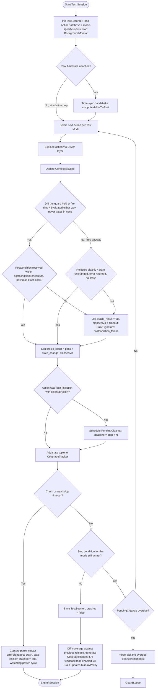
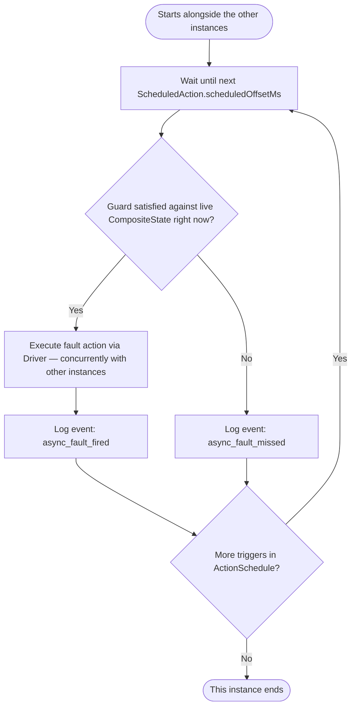

# Model-Based Testing, with AI assistance — Runtime Flow Chart

Execution order of a single test session, from cold start to session save + coverage
feedback. This is the *dynamic* counterpart to `data_structure.md` (types) and
`architecture_overview.md` (component relationships).

## Design notes

- **The guard judges, it does not gate.** Every call goes out; the guard decides which
  assertion applies. Held: the action's own `postcondition`. Did not hold: the generic rule
  — state unchanged, an error returned, no crash. That one rule is what makes an action-led
  probe an assertion rather than noise, and it needs no per-action authoring.
- **This chart is one worker's loop, not necessarily the only one running.** A
  session can configure more than one `WorkerConfig` (see `data_structure.md`),
  each spawning an independent instance of this exact flow, concurrently, each
  scoped by its own `componentFilter` (which component it moves) and `executorFilter`
  (whether it acts through the Pod's own API or through test equipment) — so
  `SelectAction` only ever draws from that worker's slice of the Action Database, not
  the whole thing. The default,
  unchanged-from-before case is a single worker scoped to everything. Nothing else
  in this chart changes per worker: `GuardCheck`, `OracleCheck`,
  `ScheduleCheck`/`PendingCheck`/`ForceCleanup`, and `LoopCheck` all work exactly the
  same inside each concurrent instance. This specific flow is what a worker configured
  waits for its own action to resolve — see below for the clock-driven kind, which is the
  same class configured differently, not a different chart bolted on. Concurrency is a property of *how many of
  this loop run*, not a different loop.
- **`Init` and `LoopCheck` depend on the kind of worker.** A walker loads the chain for
  its component; a probe loads only its pool; a schedule loads a list of times. A walker
  and a probe end on `durationMs`; a schedule ends when its list runs out, which is the one
  kind whose length you can count in advance. The published Blueprint's Fig. 3 lets a
  reader pick a kind and see what those two nodes — and `SelectAction` — do for it.

- The `Handshake` branch is still the only place simulation and real hardware diverge —
  everything downstream of it is the same graph either way. `Init` now folds together
  three setup steps that used to be separate boxes (`TestRecorder` init, loading
  `ActionDatabase`/`MarkovPolicy`, starting the `BackgroundMonitor` thread) since none
  of them branch on anything.
- `SelectAction` stands in for three ways of choosing, collapsed into one box because they
  all feed the same oracle: a **walk** rolls this state's row in the chain, a **probe**
  picks from its pool regardless of state, and a **schedule** takes the next entry off a
  timed list. No branch here calls an LLM — the AI reads the run folder afterwards, never
  during.

- `OracleCheck` catches a transition that succeeded (no exception, Guard passed, state
  updated) and is still **wrong** — e.g. `WifiState` reports `Connected` but the device
  never got a valid IP. It's a retry loop on the Host clock, not a single instant check,
  because real hardware effects aren't instantaneous; either way it records how long the
  postcondition actually took to resolve (`details.elapsedMs`), which trends upward
  before a lot of real failures do. A fail clusters as `ErrorSignature.triggerType =
  postcondition_failure` but does **not** halt the loop or trigger the watchdog — the
  device is still alive and responsive, just wrong.
- `CrashCheck = Yes` is the only path that triggers the Hardware Watchdog power-cycle,
  which is what makes unattended overnight Longevity Test runs survive a hard hang
  instead of stalling forever.
- `ScheduleCheck` / `PendingCheck` / `ForceCleanup` are the rollback safety net,
  unchanged from before: only `fault_injection` actions with a `cleanupAction` register
  a deadline. If normal Markov/AI selection hasn't happened to pick that cleanup action
  by the deadline, the loop forces it as the next step instead of asking
  `SelectAction` — this is what stops the system from getting stuck in a
  deliberately-broken state (e.g. Wi-Fi left disconnected after `inject_wifi_drop`) for
  the rest of a long session. `ForceCleanup` still goes through `GuardCheck` like any
  other pick, it just skips the selection step.

## The `async_scheduler` worker — a differently-paced instance of the same loop

Everything above describes one worker that waits for its own action to resolve —
a walker — paced by its own steps, never starting a new action before the last one
resolves. A worker reading a clock runs alongside it on wall-clock offsets, which is what
makes a mid-flight fault reachable. Same class, different kind: a worker with a schedule
does, following an `ActionSchedule` instead of picking live.

- `AGuard` reads whatever `CompositeState` the State Observer reports *at that exact
  instant* — which may be mid-way through a `sync_scheduler` instance executing a
  completely different action. That's the entire point: it's checking reality as it
  stands, not waiting for a step boundary that the other instance hasn't reached yet.
- A miss is not a retry. If `AGuard` fails — reality drifted further from the
  schedule's offline estimate than expected, e.g. DHCP resolved faster or slower
  than assumed — this instance logs `async_fault_missed` and moves on to the next
  scheduled trigger. It does not wait around for the window to reopen, and it does
  not force the action the way `ForceCleanup` does — a missed trigger is informative
  (the real device's timing didn't match the plan), not a fault the system needs to
  correct.
- `ActionSchedule`'s trigger offsets can be estimated offline, cheaply, by
  running the *simulated* model first. What cannot be precomputed is whether a given
  trigger actually fires — that decision is always made live, against the real
  device's actual state. Precomputing the full run in advance and replaying it blind
  would only be testing the simulation's assumptions, not the real hardware.
- **This instance and the `sync_scheduler` instances above usually aren't calling the
  same thing.** A fault worker is normally scoped `executorFilter: ["equipment"]`, so
  `AExec` drives a smart plug, a controllable AP, a DHCP server or an RF attenuator —
  physically separate interfaces from the Pod API the `["dut"]` workers use. That is
  what makes firing mid-flight safe rather than merely possible: there is no shared
  Driver to race on. Shared *state* still needs a lock (`CompositeState`,
  `CoverageTracker` — see `data_structure.md`), and a worker deliberately scoped to
  span both executors would reintroduce contention, which is a reason to scope it
  on purpose rather than by default.
